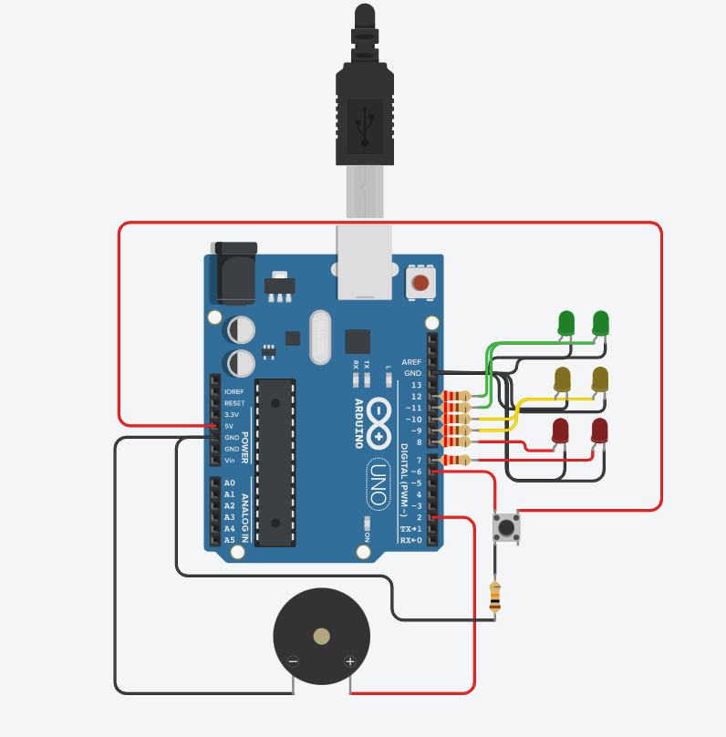

## Documentacion Dojo D Ejercicio 1

## Integrantes
- De Maio, Juan Pablo
- Martínez Balian, Francisco

## Proyecto: Semáforos.

## Descripción
Este proyecto se creó con la intención de lograr un semáforo el cual sirva para todas las personas, incluidas las no videntes. Para lograrlo utilizamos un piezo, que emite una secuencia de pitidos fuertes cuando el semáforo está en rojo. Hay 6 leds en total, 3 corresponden a un semáforo y los otros 3 a otro. Estos funcionan en conjunto.

## Función principal: sonar_piezo(int piezo, int veces, int tono)
Esta funcion se encarga de sonar el piezo cuando corresponde y también de apagarlo cuando no tiene que sonar.
- PIEZO es un #define que se utiliza para referirnos al piezo como tal (indica en que pin está conectado).
- 10 son las veces que va a sonar.
- 1000 es el tono que va a tener.

~~~ C (lenguaje en el que esta escrito)

sonar_piezo(PIEZO, 10, 1000); //llamada en la funcion

void sonar_piezo(int piezo, int veces, int tono)
{
  int tiempo = 250;

  if(tono < 500) //si el sonido es bajo
  {
    tiempo = 300;
  }
  
  for(int contador = 0; contador < veces; contador ++)
  {
    tone(piezo, tono);
    Serial.println("Hago sonar");
    delay(tiempo);
    noTone(piezo);
    Serial.println("Dejo de sonar");
    delay(tiempo);
  }
}
~~~

## :robot: Link al proyecto
- [Proyecto de Tinkercad]([https://www.tinkercad.com/things/aOYiibnDjWu](https://www.tinkercad.com/things/eC3Yu3tqiKS?sharecode=1y7bT8_4zWnDAKFgYElS3-JSdKASGZVDiffu9hXp7bk))
